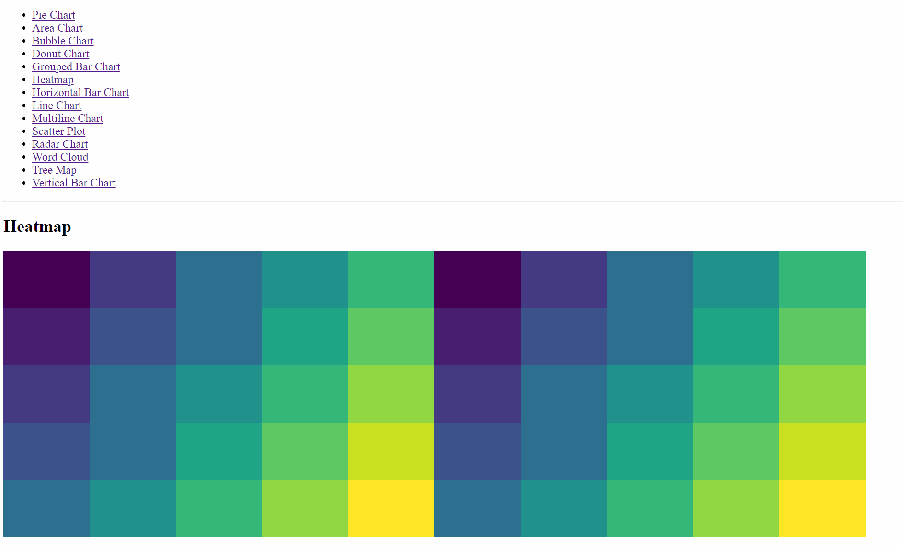

# React Project with D3.js Charts

This project demonstrates the integration of various D3.js charts into a React application. Each chart type is implemented as a separate component, allowing for easy visualization of different data sets.

## Available Charts

- Pie Chart
- Area Chart
- Bubble Chart
- Donut Chart
- Grouped Bar Chart
- Heatmap
- Horizontal Bar Chart
- Line Chart
- Multiline Chart
- Scatter Plot
- Radar Chart
- Word Cloud
- Tree Map
- Vertical Bar Chart

## Demo

## Installation

1. Clone this repository to your local machine.
2. Navigate to the project directory.
3. Run `yarn install` to install the required dependencies.
4. Run `yarn start` to start the development server.

## Usage

- Visit different routes to see each chart type in action.
